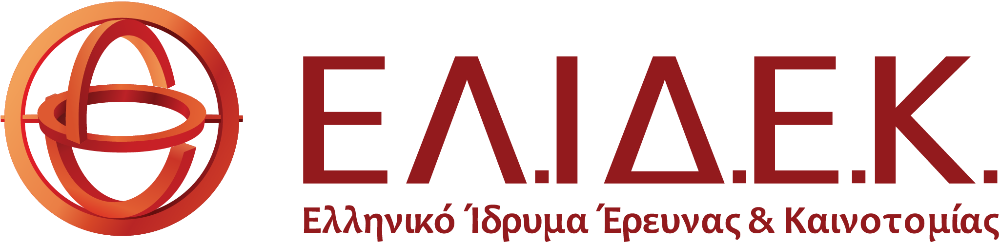
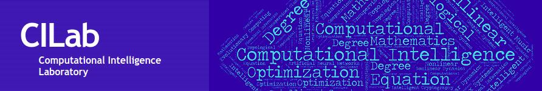

---
  hide:
    -navigation
---

# Welcome to NOSALRO project's webpage

## Novel Optimization Methods for Autonomous Skill Learning in Robotics

Humans are able to continuously learn in an open-ended manner via interactions with their environment. Human development is autonomous and dynamic: humans decide by themselves what to do, what to learn or what they are more interested in. For example, infants often do not play with the toys shown by the parents/other adults, but they invent their own toys and learning sequences. So far, no intelligent machine has the capacity to develop in an autonomous open-ended manner through lifelong learning and interactions. Building such a robot/machine is one of greatest challenges of robotics and machine learning. If we are to see robots learning in an autonomous and open-ended manner, we need to develop methods for incremental and autonomous skill discovery and trial-and-error learning. In other words, we want our robots to be able to autonomously select their goals according to their current capabilities and learn controllers or policies to achieve those goals. NOSALRO aims at tackling this challenge by exploiting deterministic simulations, quality diversity (QD) optimization, and Variational Auto-Encoders for exploring the state-space, and Learning from Demonstration (LfD) methods for fast and robust learning of high-performing controllers. We envision a robot that possess internal models of the world (e.g., simulators) and performs cycles of days and nights, where the days the robot interacts with the environment, and the night uses probabilistic models to improve the already learned or discover new skills. The developed methods will be extensively evaluated on realistic open-ended simulation environments, that will emulate the physical world, of increasing difficulty and complexity: ranging from mobile manipulators in domestic environments to humanoid robots in unstructured environments.

The project is funded by [Hellenic Foundation for Research and Innovation](https://www.elidek.gr/en/homepage) (H.F.R.I.) under the "3rd Call for H.F.R.I. Research Projects to support Post-Doctoral Researchers" (project number 7541). The project is being implemented at the [Computational Intelligence Lab (CILab)](http://cilab.math.upatras.gr) of the Department of Mathematics, University of Patras, Greece.

{: style="display: block;margin-left: auto;margin-right: auto;width:70%"}

{: style="display: block;margin-left: auto;margin-right: auto;width:70%"}
